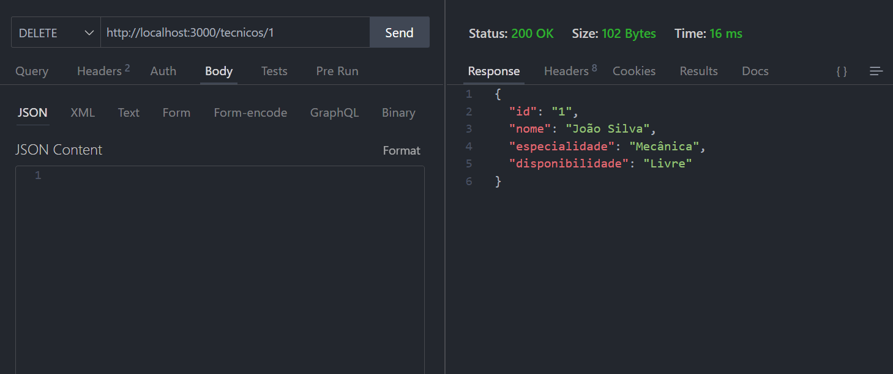

### Objetivo do Projeto

O objetivo do projeto é desenvolver um Sistema de Manutenção Preventiva e Corretiva que permita o gerenciamento eficiente de máquinas e equipamentos industriais, minimizando o tempo de inatividade e melhorando a performance operacional. O sistema deverá facilitar o registro e controle das manutenções preventivas e corretivas, gerenciar falhas e técnicos, além de gerar relatórios e indicadores de desempenho. A implementação deve ser realizada utilizando tecnologias Java e JSON, garantindo uma interface amigável e responsiva para os usuários.

### Análise de Riscos e Mitigação

| **Risco**                                | **Descrição**                                                                                   | **Probabilidade** | **Impacto** | **Mitigação**                                                                                                     |
|------------------------------------------|-----------------------------------------------------------------------------------------------|-------------------|-------------|------------------------------------------------------------------------------------------------------------------|
| **Atrasos no cronograma**                | Atrasos no desenvolvimento devido à complexidade do sistema ou à falta de recursos.          | Alta              | Alto        | Definir marcos claros e monitorar o progresso semanalmente. Realizar reuniões de status regularmente.            |
| **Problemas de integração com a API**    | Dificuldades na integração com a API JSON-Server.                                            | Média             | Alto        | Realizar testes de integração desde o início do projeto. Criar documentação clara sobre a API.                  |
| **Deficiências na segurança de dados**    | Vulnerabilidades que possam expor dados sensíveis.                                           | Média             | Alto        | Implementar autenticação e autorização adequadas. Realizar testes de segurança.                                 |
| **Interface não amigável**                | Interface que não atende às expectativas dos usuários.                                         | Média             | Médio       | Realizar testes de usabilidade e coletar feedback dos usuários durante o desenvolvimento da interface.         |
| **Falta de habilidade da equipe**         | A equipe pode não ter experiência suficiente com Java e JSON.                                 | Baixa             | Alto        | Oferecer treinamentos e workshops. Fomentar um ambiente de aprendizado colaborativo.                             |
| **Mudanças nos requisitos**                | Mudanças nos requisitos do projeto durante o desenvolvimento.                                 | Média             | Médio       | Estabelecer um processo claro de gestão de mudanças e envolver stakeholders nas discussões sobre requisitos.    |

### Levantamento de Recursos

1. **Recursos Humanos:**
   - Desenvolvedores Java

2. **Recursos Técnicos:**
   - Ambiente de Desenvolvimento Java (IDE como Eclipse ou IntelliJ)
   - Servidor para a API JSON (JSON-Server)
   - Banco de Dados (se necessário)
   - Ferramentas de Controle de Versão (Git)
   - Ferramentas de Testes (JUnit para testes unitários)

3. **Recursos Materiais:**
   - Computadores e hardware necessário para desenvolvimento
   - Licenças de software (se necessário)

4. **Orçamento:**
   - Estimar custos com pessoal, software e infraestrutura.

### Tecnologias Usadas

- **Java:** Para desenvolvimento da lógica do sistema.
- **JSON:** Para a comunicação com a API REST.
- **Swing:** Para a interface gráfica do usuário.
- **JSON-Server:** Para armazenar e recuperar dados durante o desenvolvimento.

### Cronograma de Entrega

| **Data**       | **Tarefa**                                         | **Descrição**                                                   |
|----------------|---------------------------------------------------|---------------------------------------------------------------|
| **07/10 (Hoje)** | Reunião de Kick-off                              | Apresentação do projeto, definição de papéis e responsabilidades. |
| **08/10 (Segunda)** | Levantamento de Requisitos e Especificações  | Finalização dos requisitos funcionais e não funcionais.       |
| **09/10 (Terça)** | Design da Interface Gráfica                    | Criação dos protótipos da interface e revisão com a equipe.   |
| **10/10 (Quarta)** | Implementação da API JSON-Server              | Configuração e testes iniciais da API para armazenamento de dados. |
| **11/10 (Quinta)** | Desenvolvimento da Lógica em Java              | Implementação das funcionalidades principais: CRUD e integração com a API. |
| **12/10 (Sexta)** | Testes e Validação                              | Testes funcionais e de usabilidade. Correção de bugs identificados. |
| **12/10 (Sexta)** | Entrega da Versão Inicial                      | Entrega do sistema para revisão e feedback da equipe.        |

### Notas

- **Reuniões diárias**: Recomenda-se reuniões rápidas diárias (stand-ups) para monitorar o progresso e resolver problemas rapidamente.
- **Feedback**: Após a entrega da versão inicial, coletar feedback dos usuários para futuras iterações.

### Diagramas

